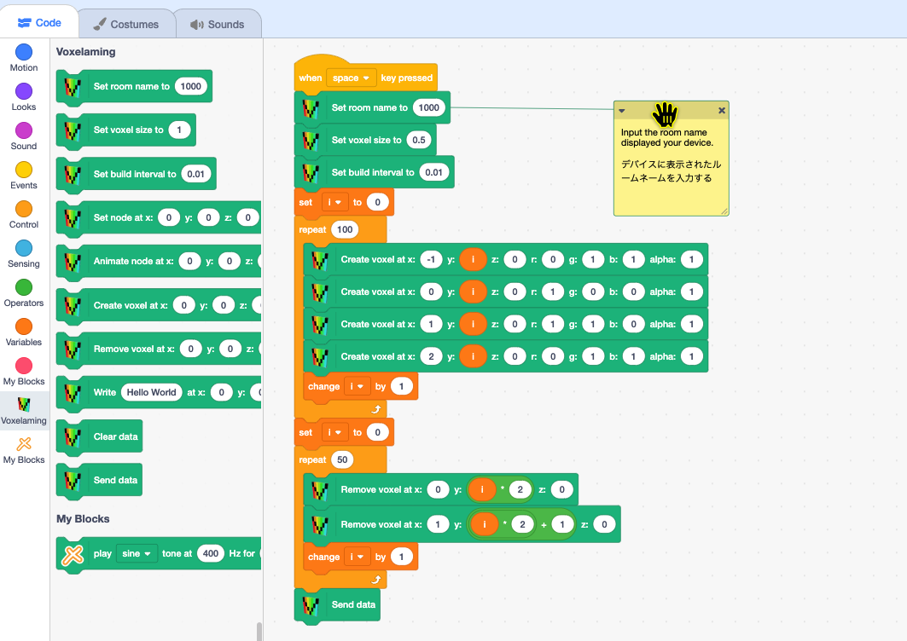

# Voxelaming - Programming learning app with ARKit


*Read this in other languages: [English](README.en.md), [日本語](README.md)*

## What is Voxelaming?

Voxelaming = Voxel + Programming

Voxelaming is a programming learning app with ARKit. It can be used for free on ARKit-compatible iPhones and iPads (iOS 13 and above). You can have fun by arranging voxels (cubical equivalent to pixels in 3D space), programmed on a computer, in a virtual space.

## Usage

### Preparing your Computer

The app supports both Windows and Mac computers. If the programming languages (Python, Node.js, Ruby, Swift) are not installed on your computer, please install the language you want to use. The data communication between your computer and device (iPhone, iPad) uses internet connection (no need to be connected to the same network). This completes the preparation of your computer.

### Setting up a Planar Anchor

Launch the Voxelaming app. You will be asked to allow camera use only for the first launch, please allow it by selecting 'Yes'. When the camera launches, ARKit automatically detects the plane of the real world. Once you see the mark (RGB coordinate axis) of plane detection, tap the screen to set up a planar anchor. The planar anchor consists of black and white tiles. This completes the preparation for placing voxels.

### Designing (Programming) the Voxels

On your computer (Windows, Mac), program the "voxel data" for placing voxels. The voxel data includes information such as "position, color, size, and placement intervals". The supported languages are Scratch3 MOD, Python, JavaScript (Node.js), Ruby, and Swift.

Let's create a script. First, set the room name to connect to the WebSocket server's room. The room name is the string displayed in the center of the device (iPhone, iPad) screen. Assign the room name to the variable room_name (roomName).

Next, using the loop statements and conditional statements of each language, create the voxel data. The position of the voxel is specified by the x, y, and z axis values relative to the planar anchor. The x-axis represents left-right, the y-axis represents up-down, and the z-axis represents depth (front is plus) (unit is centimeters). The size of the voxel is specified in decimal based on 1.0cm. The color is specified in decimal from 0 to 1 in RGB values. Also, specify the interval for placing voxels in seconds. By specifying the interval to place the voxels, the voxels will not be placed all at once, but will be placed over time.

### Placing Voxels

When you run the script, the voxel data is sent to the device (iPhone, iPad) via WebSocket communication. Once the data is received, the AR voxels are placed based on the planar anchor on the device screen.

** If the WebSocket server is in sleep mode, data transmission may fail. In that case, please wait for a while and try running again.

## Method Description

We will explain the methods used in the script. The method names for each language are as follows:

* set_box_size(size): Sets the size of the voxel. The unit is centimeters. The default is 1.0.
* set_build_interval(interval): Sets the interval for placing voxels. The unit is seconds. The default is 0.01.
* create_box(x, y, z, r, g, b): Places a voxel. Specify the position in x, y, z axis, and the color. Color is specified in decimal from 0 to 1 in RGB values.
* remove_box(x, y, z): Removes a voxel. Specify the position in x, y, z axis. (If no voxel is at the specified position, nothing happens.)
* send_data(): Sends voxel data to the device (iPhone, iPad).
* clear_boxes(): Removes all placed voxels. Also resets the size and interval.

Please translate snake case to camel case as needed. (set_box_size -> setBoxSize)

## Example Scripts

In the sample folder, we have prepared examples of scripts. Running the script below will place voxels as shown in the image.

### Scratch3 MOD

Please load the Voxelaming extension and create your script.

[Sample project with Xcratch](https://xcratch.github.io/editor/#https://creativival.github.io/voxelaming-extension/projects/example.sb3)



### Python (3.6+)

#### Script

```python
# Python
from build_box import BuildBox

room_name = "1000"
build_box = BuildBox(room_name)

build_box.clear_boxes()
build_box.set_box_size(0.5)
build_box.set_build_interval(0.01)

for i in range(100):
  build_box.create_box(-1, i, 0, 0, 1, 1)
  build_box.create_box(0, i, 0, 1, 0, 0)
  build_box.create_box(1, i, 0, 1, 1, 0)
  build_box.create_box(2, i, 0, 0, 1, 1)

for i in range(50):
  build_box.remove_box(0, i * 2 + 1, 0)
  build_box.remove_box(1, i * 2, 0)


# for i in range(-10, 11):
#   for j in range(0, 11):
#     for k in range(-10, 11):
#       if i ** 2 + j ** 2 + k ** 2 < 10 ** 2:
#         print(i, j, k)
#         build_box.create_box(i, j, k, 0, 1, 1)

build_box.send_data()
```

#### Run script

```bash
$ python main.py

or  

$ python3 main.py
```

### JavaScript (Node.js)

#### Script

```javascript
// JavaScript (Node.js)
import BuildBox from './buildBox.mjs';

const roomName = '1000';
const buildBox = new BuildBox(roomName);

buildBox.clearData();
buildBox.setBoxSize(0.5);
buildBox.setBuildInterval(0.01);

for (let i = 0; i < 100; i++) {
  buildBox.createBox(-1, i, 0, 0, 1, 1);
  buildBox.createBox(0, i, 0, 1, 0, 0);
  buildBox.createBox(1, i, 0, 1, 1, 0);
  buildBox.createBox(2, i, 0, 0, 1, 1);
}

for (let i = 0; i < 50; i++) {
  buildBox.removeBox(0, i * 2, 0);
  buildBox.removeBox(1, i * 2 + 1, 0);
}

buildBox.sendData();
```

#### Run script

```bash
$ node main.mjs
```

### Ruby

#### Script

```ruby
# Ruby
require_relative 'build_box'

room_name = '1000'
build_box = BuildBox.new(room_name)

build_box.clear_boxes()
build_box.set_box_size(0.5)
build_box.set_build_interval(0.01)

for i in 0...100
  build_box.create_box(-1, i, 0, 0, 1, 1)
  build_box.create_box(0, i, 0, 1, 0, 0)
  build_box.create_box(1, i, 0, 1, 1, 0)
  build_box.create_box(2, i, 0, 0, 1, 1)
end

for i in 0...50
  build_box.remove_box(0, i * 2, 0)
  build_box.remove_box(1, i * 2 + 1, 0)
end

build_box.send_data
```

#### Run script

```bash
$ ruby main.rb
```

### Swift

#### Script

```swift
// Swift (Refactaring is required)
import Foundation

let roomName = "1000"

@available(iOS 15.0, macOS 12.0, *)
func main() async {
    do {
        let buildBox = BuildBox(roomName)

        buildBox.setSize(0.5)
        buildBox.setBuildInterval(0.01)

        for i in 0..<100 {
            buildBox.createBox(-1, Double(i), 0, 0, 1, 1)
            buildBox.createBox(0, Double(i), 0, 1, 0, 0)
            buildBox.createBox(1, Double(i), 0, 1, 1, 0)
            buildBox.createBox(2, Double(i), 0, 0, 1, 1)
        }

        for i in 0..<50 {
            buildBox.removeBox(0, Double(i * 2), 0)
            buildBox.removeBox(1, Double(i * 2 + 1), 0)
        }
        try await buildBox.sendData()
    } catch {
        print("An error occurred: \(error)")
    }
}

if #available(iOS 15.0, macOS 12.0, *) {
    Task.detached(priority: .userInitiated) {
        await main()
    }
    RunLoop.main.run(until: Date(timeIntervalSinceNow: 10)) // Or longer depending on your needs
} else {
    fatalError("This script requires iOS 15.0 / macOS 12.0 or later.")
}
```

#### Run script

```bash
$ cd swift/Sources
$ swift run
```

### Remove voxel

Prepare a script to remove the voxel.


### Animation voxel

Prepare a script to animate the voxel.

### User Sharing

Prepare a script to share the voxel with other users.

## Settings

You can move to the settings screen from the "Settings" button at the top right of the screen. If you turn off debug mode, the information display on the screen will be disabled.

## License

[MIT License](https://github.com/creativival/Voxelaming/blob/master/LICENSE)

## Author

creativival


